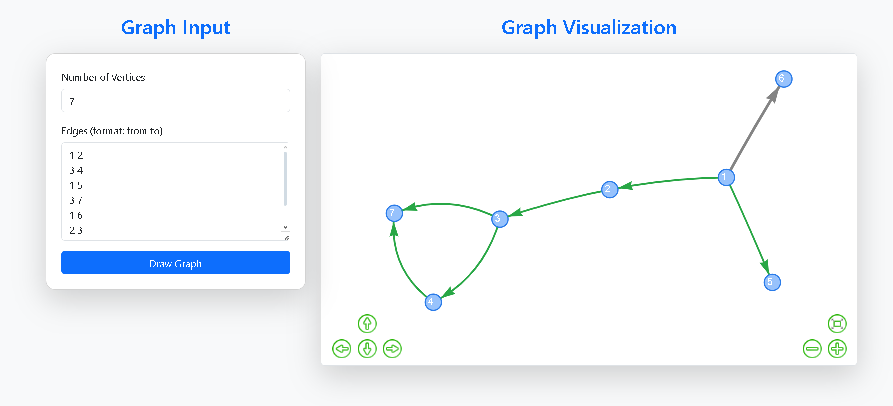

🌦️ Predictive Weather App
A fullstack weather application that fetches real-time weather data and predicts the next day's forecast.
Built using a custom FastAPI backend and a simple, responsive frontend.

## 📸 Demo

🔗 **Live Demo:** [View Here](https://luimas007.github.io/graph-visualizer/)

🚀 Features
🌤️ Real-time weather updates based on user input

🔮 Predicts the weather for the next day

🔗 Connects to a custom backend API for live data

📱 Responsive design for desktop and mobile

🛠️ Tech Stack
Frontend:
HTML

CSS

JavaScript

Backend:
Python

FastAPI

Web Scraping (to fetch live data)

📂 Project Structure
bash
Copy
Edit
/front-weather     # Frontend project (hosted on GitHub Pages)
/weather           # Backend API (FastAPI app)
Frontend is purely static and interacts with the backend using HTTP requests.

Backend scrapes live weather data, processes it, and serves it via RESTful APIs.

📦 Installation (Local Setup)
Backend (FastAPI)
Clone the backend repository:

bash
Copy
Edit
git clone https://github.com/Luimas007/weather.git
cd weather
Install dependencies:

bash
Copy
Edit
pip install fastapi uvicorn beautifulsoup4 requests
Run the FastAPI server:

bash
Copy
Edit
uvicorn main:app --reload
Server will start at: http://127.0.0.1:8000

Frontend
Clone the frontend repository:

bash
Copy
Edit
git clone https://github.com/Luimas007/front-weather.git
cd front-weather
Simply open index.html in your browser or deploy it using GitHub Pages.

🔥 Future Improvements
Add weather icons based on conditions (e.g., sunny, cloudy)

Extend predictions for multiple days

Add loading animations and error handling UI

Deploy backend to a public server (e.g., Render, Railway)

✨ Author
Made with ❤️ by Samiul Haque Siddique

📜 License
This project is licensed under the MIT License.
Feel free to use, modify, and distribute! 🎯
